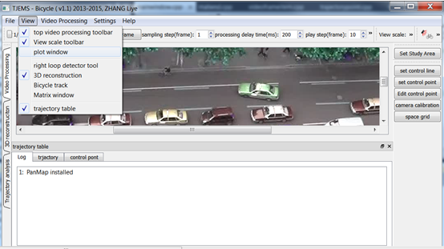

# TJEMS-bicycle
====
#### Bicycle traffic video processing and  trajectory management system

STSS-bicycle is a bicycle trajectory extraction software for cycling behavior modeling study. Developed by **[Dr. Liye Zhang]**, National University of Singapore. This can be only used for academic purpose.

[Dr. Zhang Liye]: http://www.maritimestudies.nus.edu.sg/people.html
[Centre for Maritime Studies]: http://www.maritimestudies.nus.edu.sg/

## Compile

Visual C++ 2010, Qt4.8.

Tested platform: windows 7, 32 and 64.
